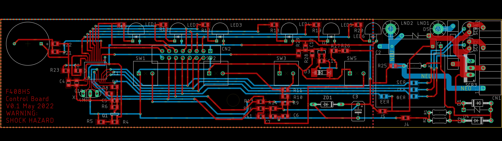

# Control board for Panasonic F-408HS 16" Stand Fan

## *** Warning  ***

This repository contains circuit designs for a printed circuit board that uses 240VAC as a power source, and can hence cause serious injury or death to anyone who implements the design. 

## Disclaimer

By using any of the designs here, you agree to waive the author of all liability for any personal or 3rd party injury or death, or damage to property sustained as a result of using the designs.

## License

These designs were made using a free version of [Autodesk Eagle](http://eagle.autodesk.com). Commercial use of designs is prohibited.

Furthermore: [License](./LICENSE)

## Overview

The design contained here contains both a [schematic](./eagle/F408HS_control.sch) that is inspired by the original board design, and a board [layout](./eagle/F408HS_control.brd) that has been revamped and optimized for 2-layer fabrication and debugging.

## Components and BOM

Most of the components used have been listed in the [Bill-Of-Materials](./eagle/BOM.txt) list. Some special ones that were hard to locate are connectors for the motor (CN1) and the AC input to the control board itself. These are:

* Japan Automatic Machine (JAM) SC25-10WL
* Japan Solderless Terminals (JST) ELR-03V

### Component Values

Values for transistors Q1 and Q2 were determined based on SMD markings, which may be erroneous.

Values for capacitors and zener diode were determined empirically using simulation in [LTSpice](https://www.analog.com/en/design-center/design-tools-and-calculators/ltspice-simulator.html). 

## LT SPICE Simulations

* [Power](./spice/power.asc)
* [Phase Sync](./spice/phase_sync.asc)

## Layout

The [layout](./eagle/F408HS_control.brd) was designed with 2 layer boards in mind. Without the contraints of a single layer board, J1 - J3 are no longer needed to bridge over tracks.

The 240AC tracks have also been constrained to the right side of the board, making it slightly less risky while probing the board. The AC section can also be left unpopulated, using an externally sourced Vdd and Vss via CN2 for debugging the low voltage section. 

 ## Schematic

 

 ### AC Phase Sync

 The output of the AC phase sync circuit is connected to P13 of the MCU. Hence it is possible that the interrupt capability of that pin is used to synchronise the TRIAC trigger with the AC phase. Modulating the TRIAC duty cycle is probably needed for the 揺らぎ "Yuragi" fluctuation function, to lower the motor RPM.